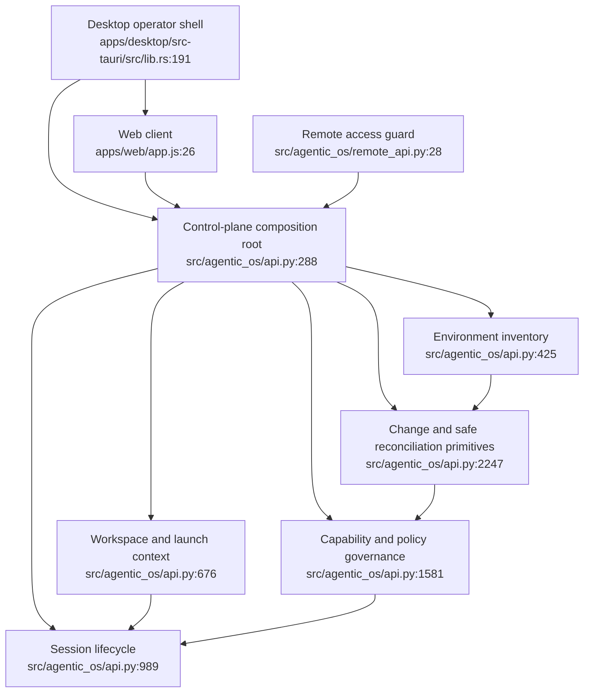

# agentic-os Feature Inventory

Date: 2026-07-17

## Scope

This inventory maps the current production source before the Desktop redesign.
The target product vocabulary is a Local Agent Environment Manager, but the
boundaries below describe current responsibilities rather than assuming the
proposed architecture already exists.

Feature discovery was delegated to a read-only Codex CLI subprocess because
the preferred ACPX runner was unavailable. The subprocess reported exact
source locations; the orchestrator then checked the main composition root,
route groups, Web shell, and Tauri lifecycle before consolidating its initial
20 implementation-shaped groups into six product-shaped systems.

Excluded from discovery:

- tests, except as later verification evidence;
- generated Tauri schemas and bundled source copies;
- `node_modules`, Rust `target`, icons, and bundled Python runtime;
- iOS companion code, which is not part of the requested macOS Desktop goal.

## Feature boundaries

### 1. Environment inventory

Purpose: identify each managed agent environment and report its independently
observed CLI, configuration, capability, agentic-runtime, health, and adapter
contract evidence.

Current entry points:

- `src/agentic_os/api.py:395` — registry-backed agent list.
- `src/agentic_os/api.py:425` — CLI binary and version discovery.
- `src/agentic_os/api.py:443` — non-secret configuration inventory.
- `src/agentic_os/api.py:463` — skills, MCP, plugin, and memory inventory.
- `src/agentic_os/api.py:595` — agentic-runtime inventory.
- `src/agentic_os/api.py:616` — harness adapter contracts.
- `src/agentic_os/api.py:645` — per-harness health.

Core files:

- `src/agentic_os/registry.py`
- `src/agentic_os/models.py`
- `src/agentic_os/tool_discovery.py`
- `src/agentic_os/config_inventory.py`
- `src/agentic_os/capability_inventory.py`
- `src/agentic_os/agentic_inventory.py`
- `src/agentic_os/adapter_contract.py`
- `src/agentic_os/health_prober.py`

Boundary: this feature observes and normalizes facts. It does not mutate
configuration, launch sessions, or infer that one surface proves another.

### 2. Session lifecycle and observation

Purpose: launch agentic-os-managed runs; discover native sessions; support
resume, attach, stop, retry, transcript, logs, timelines, usage, and evidence.

Current entry points:

- `src/agentic_os/api.py:989` — managed run creation.
- `src/agentic_os/api.py:1043` — managed run list.
- `src/agentic_os/api.py:1049` — native live-session discovery.
- `src/agentic_os/api.py:1063` — native transcript tail.
- `src/agentic_os/api.py:1090` — open native session in Terminal.
- `src/agentic_os/api.py:1110` — run events.
- `src/agentic_os/api.py:1119` — evidence metadata.
- `src/agentic_os/api.py:1158` — combined timeline.
- `src/agentic_os/api.py:1282` — bounded logs.
- `src/agentic_os/api.py:1319` — external-session discovery.
- `src/agentic_os/api.py:1346` — external-session binding.
- `src/agentic_os/api.py:1414` — stop.
- `src/agentic_os/api.py:1423` — retry.
- `src/agentic_os/api.py:1511` — attach.

Core files:

- `src/agentic_os/supervisor.py`
- `src/agentic_os/storage.py`
- `src/agentic_os/live_sessions.py`
- `src/agentic_os/attach.py`
- `src/agentic_os/logs.py`
- `src/agentic_os/evidence.py`
- `src/agentic_os/usage.py`

Boundary: the daemon remains the only owner of managed subprocesses. Native
upstream sessions stay externally owned and are only observed or opened
through explicitly supported adapter operations.

### 3. Capability and policy governance

Purpose: maintain the shared capability catalog and policy records, evaluate
launches, handle human approvals, audit decisions, and expose operational
health/capacity.

Current entry points:

- `src/agentic_os/api.py:1581` — approval queue.
- `src/agentic_os/api.py:1725` — session memory review pipeline.
- `src/agentic_os/api.py:1781` — skill catalog.
- `src/agentic_os/api.py:1922` — MCP catalog.
- `src/agentic_os/api.py:2064` — policy records and evaluation.
- `src/agentic_os/api.py:2212` — audit events.
- `src/agentic_os/api.py:2727` — fleet health.
- `src/agentic_os/api.py:2747` — capacity.

Core files:

- `src/agentic_os/control_plane.py`
- `src/agentic_os/control_plane_history.py`
- `src/agentic_os/approvals.py`
- `src/agentic_os/audit.py`
- `src/agentic_os/fleet.py`
- `src/agentic_os/memory.py`
- `src/agentic_os/memory_store.py`

Boundary: catalog and policy records describe or gate capabilities. Reading an
upstream capability and reconciling its configuration belong to Environment
inventory and Change management, respectively.

### 4. Change planning and safe reconciliation

Purpose: compare effective state across scopes, preview exact operations,
apply validated changes, preserve backups/history, verify results, and roll
back supported mutations.

Current entry points:

- `src/agentic_os/api.py:511` — MCP alignment matrix.
- `src/agentic_os/api.py:534` — MCP copy, dry-run by default.
- `src/agentic_os/api.py:568` — MCP remove, dry-run by default.
- `src/agentic_os/api.py:2247` — workflow-surface inventory.
- `src/agentic_os/api.py:2273` — workflow-surface diff.
- `src/agentic_os/api.py:2326` — workflow-surface patch.
- `src/agentic_os/api.py:2383` — patch history.
- `src/agentic_os/api.py:2403` — rollback.
- `src/agentic_os/api.py:2513` — agentic-os configuration state.
- `src/agentic_os/api.py:2545` — agentic-os configuration patch.
- `src/agentic_os/api.py:2621` — harness-native configuration state.
- `src/agentic_os/api.py:2656` — harness-native configuration patch.

Core files:

- `src/agentic_os/safe_edit.py`
- `src/agentic_os/patch_engine.py`
- `src/agentic_os/backup_store.py`
- `src/agentic_os/catalog.py`
- `src/agentic_os/config_scope.py`
- `src/agentic_os/harness_config.py`
- `src/agentic_os/mcp_alignment.py`
- `src/agentic_os/schema_registry.py`

Boundary: every mutation must be representable as observed state, desired
state, reviewable plan, explicit approval, apply result, verification result,
and durable record. Current safe-edit primitives exist, but no single
cross-surface reconcile resource owns this whole lifecycle yet.

### 5. Workspace and launch context

Purpose: manage project roots, profiles, provider/model choices, and reusable
run templates that resolve into Session lifecycle requests.

Current entry points:

- `src/agentic_os/api.py:676` — profiles.
- `src/agentic_os/api.py:805` — profile diff.
- `src/agentic_os/api.py:825` — project/profile binding.
- `src/agentic_os/api.py:3190` — workspace list and creation.
- `src/agentic_os/api.py:3210` — active workspace.
- `src/agentic_os/api.py:3219` — workspace dashboard aggregate.
- `src/agentic_os/api.py:3235` — run templates.
- `src/agentic_os/api.py:3250` — resolved launch preview.

Core files:

- `src/agentic_os/workspaces.py`
- `src/agentic_os/profiles.py`
- `src/agentic_os/run_templates.py`
- `src/agentic_os/registry.py`

Boundary: this feature resolves operator intent and launch context. It does not
own subprocesses or mutate upstream environment configuration.

### 6. Desktop operator and connection shell

Purpose: present the operator experience, supervise the packaged local stack,
bridge local/remote API requests, protect remote credentials, and expose
diagnostics/import/export.

Current entry points:

- `apps/web/app.js:26` — Web shell initialization.
- `apps/web/app.js:88` — 15-tab navigation binding.
- `apps/web/app.js:175` — tab state and panel loading.
- `apps/desktop/src-tauri/src/lib.rs:17` — Tauri commands.
- `apps/desktop/src-tauri/src/lib.rs:101` — connection bridge.
- `apps/desktop/src-tauri/src/lib.rs:191` — Desktop application lifecycle.
- `apps/desktop/src-tauri/src/supervisor.rs:131` — daemon health/restart loop.
- `src/agentic_os/remote_api.py:28` — remote API registration.
- `src/agentic_os/api.py:2766` — diagnostics.
- `src/agentic_os/api.py:3135` — setup log bundle.
- `src/agentic_os/api.py:3161` — setup export/import.

Core files:

- `apps/web/index.html`
- `apps/web/app.js`
- `apps/web/api.js`
- `apps/web/ui/*.js`
- `apps/desktop/src-tauri/src/lib.rs`
- `apps/desktop/src-tauri/src/daemon.rs`
- `apps/desktop/src-tauri/src/supervisor.rs`
- `apps/desktop/src-tauri/src/connection.rs`
- `apps/desktop/src-tauri/src/settings.rs`
- `apps/desktop/src-tauri/src/remote.rs`
- `apps/desktop/src-tauri/src/keychain.rs`
- `src/agentic_os/remote_api.py`
- `src/agentic_os/remote_gateway.py`
- `src/agentic_os/import_export.py`
- `src/agentic_os/diagnostics.py`

Boundary: the UI and Tauri code remain thin clients and lifecycle owners. They
must not recreate domain decisions already owned by the daemon.

## Current top-level relationship

## Boundary review

These six boundaries are accepted for Pathfinder Phase 1. They deliberately
do not mirror the current 15 navigation tabs. The most important architectural
gap is already visible: Environment inventory and Change management have many
tool-specific readers and patch paths, but no common Environment State or
Reconcile Plan resource connects them.

