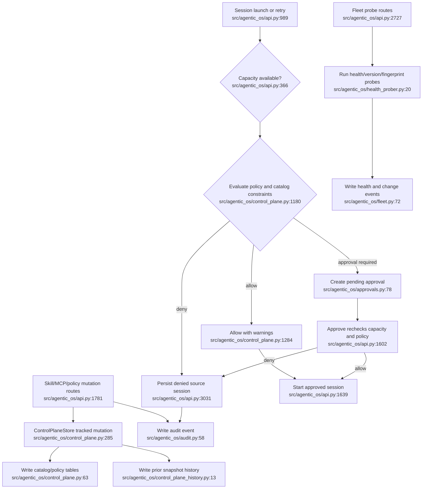

# Capability and Policy Governance — Current Flow

## Sources consulted

- `/Users/waynetu/bootstrap/agentic-os/src/agentic_os/api.py:366-389,989-1041,1423-1723,1781-2235,2727-2764,2891-3113`
- `/Users/waynetu/bootstrap/agentic-os/src/agentic_os/control_plane.py:234-265,285-1392`
- `/Users/waynetu/bootstrap/agentic-os/src/agentic_os/control_plane_history.py:13-150`
- `/Users/waynetu/bootstrap/agentic-os/src/agentic_os/approvals.py:78-198`
- `/Users/waynetu/bootstrap/agentic-os/src/agentic_os/audit.py:20-213`
- `/Users/waynetu/bootstrap/agentic-os/src/agentic_os/fleet.py:72-183`
- `/Users/waynetu/bootstrap/agentic-os/src/agentic_os/health_prober.py:20-78`

## Findings

Shared skill, MCP, and policy records are persisted with history and redaction.
Policy evaluation is reused by launch, retry, and approval recheck. Launch is
open-by-default when no policy exists even though the explicit policy-evaluate
endpoint returns deny for a missing policy.

## Side effects and fallback behavior

- Catalog records, control-plane history, approvals, audit events, fleet health,
  and fleet events share `agentic-os.db`.
- Read-time approval refresh can mutate pending approval state to expired.
- One fleet probe exception does not fail all probes.
- Catalog mutation and audit recording are separate SQLite transactions.
- `rate_limit_per_minute` is validated and returned as metadata but is not
  enforced by a runtime counter.

## External dependencies

- Session lifecycle owns source and approved sessions.
- Workspace context supplies cwd/model/tool inputs to policy evaluation.
- Environment inventory supplies registered harnesses and probe commands.
- Change management has a separate catalog/config mutation system.

## Confidence and gaps

Confidence: high for persistence and launch gates.

Known gaps: missing-policy semantics differ by endpoint, explicit policy
evaluation is not audited, cross-store mutations are not atomic, and governance
records do not automatically prove installed upstream capabilities.

