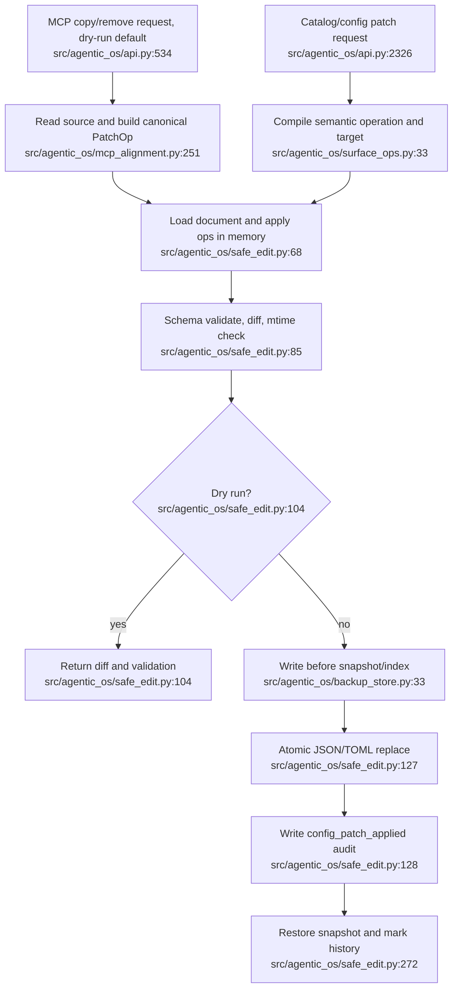

# Change Planning and Safe Reconciliation — Current Flow

## Sources consulted

- `/Users/waynetu/bootstrap/agentic-os/src/agentic_os/api.py:222-275,474-594,2247-2414,2513-2717`
- `/Users/waynetu/bootstrap/agentic-os/src/agentic_os/mcp_alignment.py:228-268`
- `/Users/waynetu/bootstrap/agentic-os/src/agentic_os/surface_ops.py:1-111`
- `/Users/waynetu/bootstrap/agentic-os/src/agentic_os/catalog.py:394-567`
- `/Users/waynetu/bootstrap/agentic-os/src/agentic_os/safe_edit.py:68-306`
- `/Users/waynetu/bootstrap/agentic-os/src/agentic_os/patch_engine.py:1-103`
- `/Users/waynetu/bootstrap/agentic-os/src/agentic_os/backup_store.py:27-159`

## Findings

MCP alignment and generic config/catalog changes converge on `SafeEditEngine`.
The engine provides schema validation, diff, optimistic mtime checking, backup,
atomic file replace, audit, and rollback. It does not own a complete reconcile
resource: apply and rollback do not re-read effective state or run health probes.

## Side effects and fallback behavior

- Backups live under `state_dir/patches`; patch index is JSONL, while audit is
  SQLite.
- JSON/TOML writes use temporary files and atomic replace.
- MCP alignment adds a target parse guard and defaults to dry-run.
- Generic catalog CLI defaults to apply and treats malformed config as an empty
  document through the generic loader.
- Backup, config write, and audit are independent operations without a shared
  transaction.

## External dependencies

- Environment inventory supplies current config/capability observations.
- Governance stores audit events.
- Desktop/remote affordances restrict most writes to localhost.

## Confidence and gaps

Confidence: high for file mutation paths.

Critical gaps:

- no post-apply or post-rollback re-read, schema/effective-state comparison, or
  tool health verification;
- generic malformed JSON/TOML can be replaced as if it were empty;
- mixed structured operations use the first operation to select one target;
- generic catalog changes are not consistently preview-first;
- rollback lacks conflict detection against later external edits.

