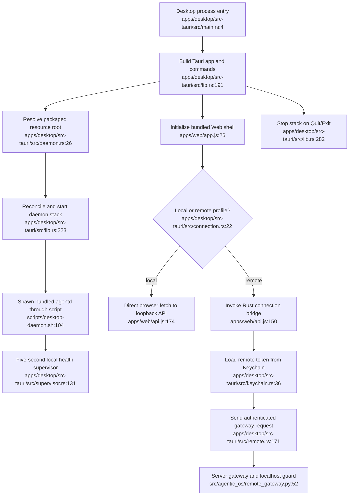

# Desktop Operator and Connection Shell — Current Flow

## Sources consulted

- `/Users/waynetu/bootstrap/agentic-os/apps/desktop/src-tauri/src/main.rs:1-6`
- `/Users/waynetu/bootstrap/agentic-os/apps/desktop/src-tauri/src/lib.rs:17-320`
- `/Users/waynetu/bootstrap/agentic-os/apps/desktop/src-tauri/src/daemon.rs:26-218`
- `/Users/waynetu/bootstrap/agentic-os/apps/desktop/src-tauri/src/supervisor.rs:11-233`
- `/Users/waynetu/bootstrap/agentic-os/apps/desktop/src-tauri/src/connection.rs:22-87`
- `/Users/waynetu/bootstrap/agentic-os/apps/desktop/src-tauri/src/settings.rs:76-149`
- `/Users/waynetu/bootstrap/agentic-os/apps/desktop/src-tauri/src/keychain.rs:3-55`
- `/Users/waynetu/bootstrap/agentic-os/apps/desktop/src-tauri/src/remote.rs:3-203`
- `/Users/waynetu/bootstrap/agentic-os/apps/web/app.js:26-233`
- `/Users/waynetu/bootstrap/agentic-os/apps/web/api.js:150-195`
- `/Users/waynetu/bootstrap/agentic-os/src/agentic_os/remote_api.py:28-113`
- `/Users/waynetu/bootstrap/agentic-os/src/agentic_os/remote_gateway.py:42-90`

## Findings

The packaged app serves bundled Web assets directly, starts the Python daemon
through lifecycle scripts, supervises local health, and bridges remote API calls
so tokens remain in macOS Keychain. The Web shell is a 15-tab client initialized
after the Desktop connection profile is loaded.

## Side effects and security boundaries

- Lifecycle commands synchronously spawn `/bin/bash` scripts with a hardened PATH.
- The daemon is loopback-only and watches the Desktop parent PID.
- Remote settings are stored in `~/.agentic-os/desktop.toml`; tokens are stored
  only in Keychain and only hashes are stored server-side.
- Gateway transport requires HTTPS except for loopback.
- Server route guards, not hidden UI controls, enforce localhost-only mutations.

## External dependencies

Every other feature is consumed through the Web/API boundary. Desktop owns only
the daemon/UI stack and connection credentials, not agent run subprocesses.

## Confidence and gaps

Confidence: high for static lifecycle and bridge behavior.

Critical gaps:

- remote bridge supports GET/POST/DELETE but not PUT although Web features issue
  PUT requests;
- remote SSE uses browser `EventSource`, cannot obtain the Keychain token, and
  therefore cannot authenticate to `/events`;
- local connection profile exposes `settings.local.api_url`, while Rust local
  dispatch uses an environment override or fixed loopback URL;
- startup discards initial start/reconcile errors and relies on later supervisor
  visibility;
- packaged WebView has `csp: null`;
- signing, notarization, updater, Keychain prompts, and packaged runtime behavior
  remain runtime-verification work.

