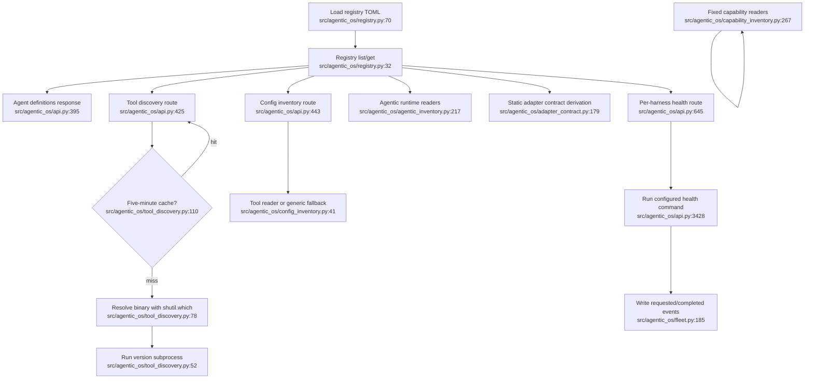

# Environment Inventory — Current Flow

## Sources consulted

- `/Users/waynetu/bootstrap/agentic-os/src/agentic_os/api.py:288-335,391-469,595-667,3413-3492`
- `/Users/waynetu/bootstrap/agentic-os/src/agentic_os/registry.py:1-80`
- `/Users/waynetu/bootstrap/agentic-os/src/agentic_os/tool_discovery.py:1-120`
- `/Users/waynetu/bootstrap/agentic-os/src/agentic_os/config_inventory.py:1-270`
- `/Users/waynetu/bootstrap/agentic-os/src/agentic_os/capability_inventory.py:1-268`
- `/Users/waynetu/bootstrap/agentic-os/src/agentic_os/agentic_inventory.py:1-226`
- `/Users/waynetu/bootstrap/agentic-os/src/agentic_os/adapter_contract.py:22-302`
- `/Users/waynetu/bootstrap/agentic-os/src/agentic_os/health_prober.py:1-78`
- `/Users/waynetu/bootstrap/agentic-os/src/agentic_os/fleet.py:1-234`

## Findings

Environment state is not currently one resource. Seven route groups independently
derive registry records, CLI status, config summaries, capabilities, agentic
runtime inventory, static adapter contracts, and health. Coverage sources also
diverge: CLI/config/agentic inventory use the registry, while capability inventory
uses a fixed six-tool reader list.

Only the per-harness health path mutates state. It executes a configured command
and records requested/completed fleet events. Other paths read the registry,
PATH, config files, directories, or cached process-local discovery results.

## Side effects and fallback behavior

- `detect_version()` has a ten-second timeout and returns a bounded error instead
  of failing the whole discovery response.
- Config and capability readers tolerate missing files and expose parse errors;
  capability file reads have a 20 MiB guard.
- Agentic inventory catches one reader failure and returns a result-level error.
- Registry load errors fail application composition; there is no degraded
  registry mode.
- `HealthProber` is a second health implementation used by `/fleet/probe`; it
  does not power `/harnesses/{id}/health`.

## External dependencies

- Change management consumes observed config/capability state.
- Session lifecycle consumes registry commands and adapter declarations.
- Governance owns fleet-health storage and events.

## Confidence and gaps

Confidence: high for static call flow.

Known gaps: no normalized environment aggregate, no surface-specific proof model,
fixed and registry-backed coverage can drift, and static contract declarations
are not verified against live runtime behavior.

