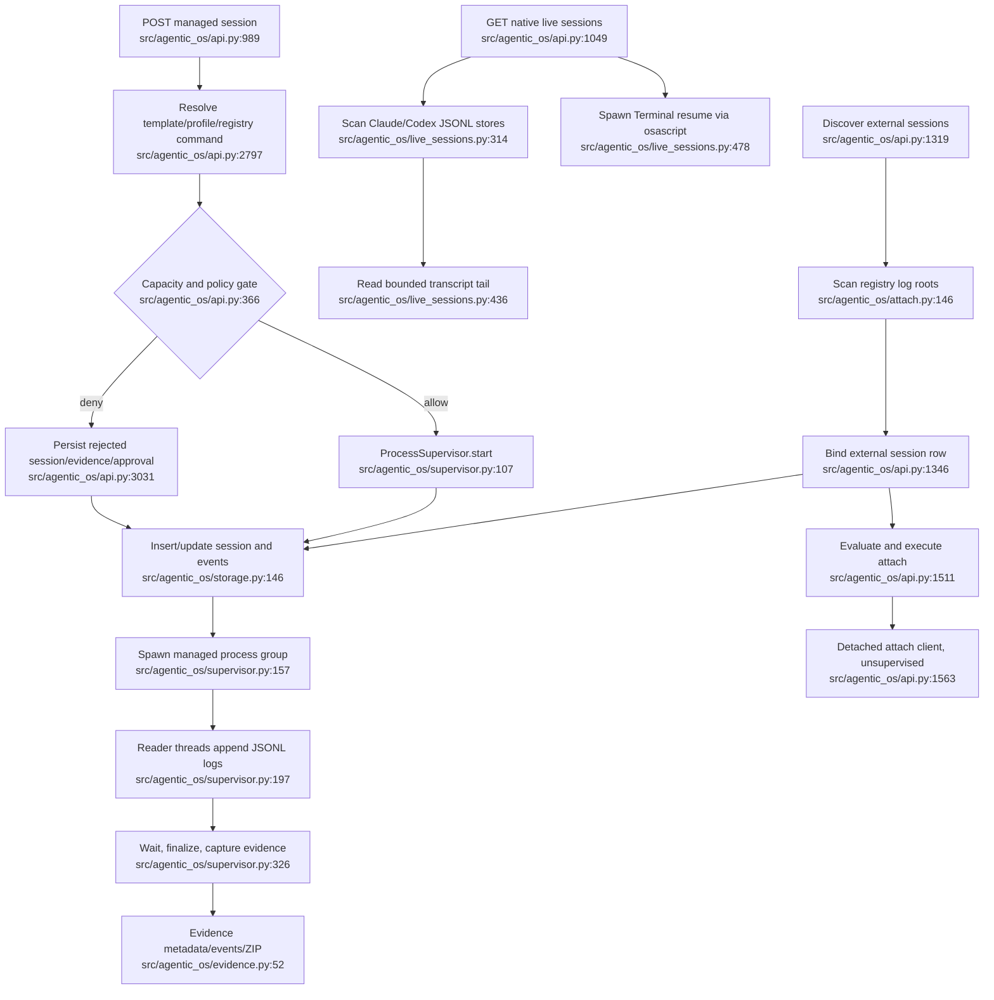

# Session Lifecycle and Observation — Current Flow

## Sources consulted

- `/Users/waynetu/bootstrap/agentic-os/src/agentic_os/api.py:366-389,989-1579,2797-3113`
- `/Users/waynetu/bootstrap/agentic-os/src/agentic_os/supervisor.py:53-215,314-510`
- `/Users/waynetu/bootstrap/agentic-os/src/agentic_os/storage.py:146-410`
- `/Users/waynetu/bootstrap/agentic-os/src/agentic_os/live_sessions.py:173-501`
- `/Users/waynetu/bootstrap/agentic-os/src/agentic_os/attach.py:81-198`
- `/Users/waynetu/bootstrap/agentic-os/src/agentic_os/logs.py:29-145`
- `/Users/waynetu/bootstrap/agentic-os/src/agentic_os/evidence.py:52-345`

## Findings

Three ownership models coexist:

1. Managed runs are fully owned by `ProcessSupervisor`.
2. Native Claude/Codex sessions remain upstream-owned and are observed through
   bounded JSONL scans or opened in Terminal.
3. Attach starts a detached client and records a PID, but does not place the
   process under supervisor lifecycle ownership.

## Side effects and fallback behavior

- Managed launch writes SQLite session/event state, JSONL logs, session JSON,
  evidence metadata/events, and artifact directories.
- Managed children use their own process group. Spawn failure is persisted as a
  failed session rather than escaping as an untracked process.
- Native scanners prune by mtime and byte/object limits. One scanner failure
  does not break the full radar.
- Native transcript paths must remain under configured roots.
- Evidence capture runs bounded Git subprocesses; Git failure degrades evidence
  metadata rather than blocking the run.

## External dependencies

- Environment inventory supplies registry commands, log roots, and adapter
  declarations.
- Workspace/launch context resolves templates and profiles.
- Governance owns capacity, policy, approval, audit, and fleet writes.

## Confidence and gaps

Confidence: high for managed/native/attach ownership.

Known gaps: native discovery has two overlapping scanner models; attach clients
have no completion, logs, evidence, stop, or crash recovery path.

