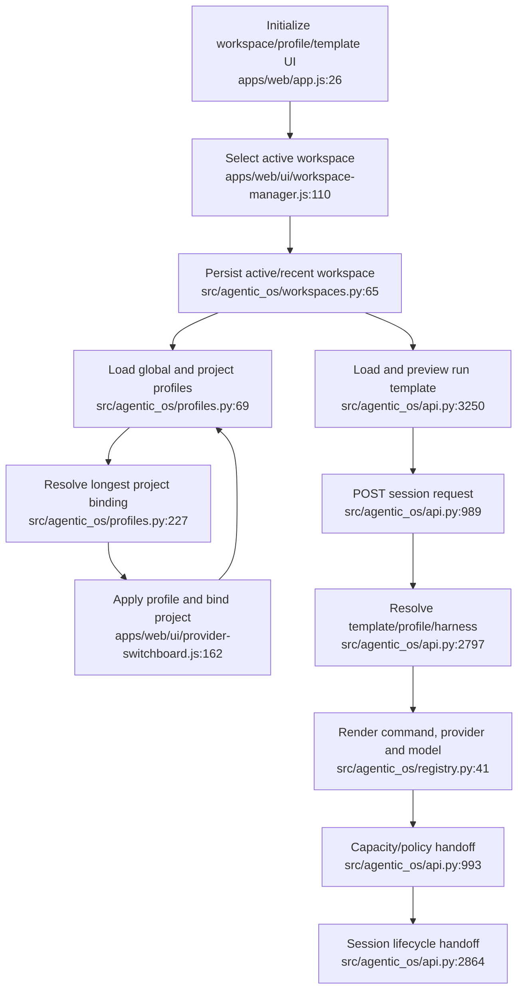

# Workspace and Launch Context — Current Flow

## Sources consulted

- `/Users/waynetu/bootstrap/agentic-os/apps/web/app.js:26-54`
- `/Users/waynetu/bootstrap/agentic-os/apps/web/ui/workspace-manager.js:85-205`
- `/Users/waynetu/bootstrap/agentic-os/apps/web/ui/provider-switchboard.js:47-232`
- `/Users/waynetu/bootstrap/agentic-os/apps/web/ui/run-template-launcher.js:110-281`
- `/Users/waynetu/bootstrap/agentic-os/src/agentic_os/api.py:676-859,2797-2862,3031-3064,3190-3318`
- `/Users/waynetu/bootstrap/agentic-os/src/agentic_os/workspaces.py:65-142`
- `/Users/waynetu/bootstrap/agentic-os/src/agentic_os/profiles.py:60-373`
- `/Users/waynetu/bootstrap/agentic-os/src/agentic_os/run_templates.py:77-186`
- `/Users/waynetu/bootstrap/agentic-os/src/agentic_os/registry.py:41-125`

## Findings

Workspace, profiles, provider/model switching, and templates resolve operator
intent before Session lifecycle. Provider/model switching actually reapplies an
existing profile and binds the workspace; it is not an independent provider
state machine.

## Side effects and fallback behavior

- Workspace and run-template state is stored in SQLite.
- Profiles and project bindings are read from global/project TOML and mutated
  through safe edit.
- Profile precedence is explicit profile, project binding, default, agent-ID
  fallback, then no profile.
- Preview resolves command context but does not run capacity or policy checks.
- Remote read-only workspace selection can update browser state without updating
  daemon state.

## External dependencies

- Environment inventory/registry supplies harness commands.
- Change management owns profile file mutation.
- Governance owns capacity and policy.
- Session lifecycle owns process creation and run persistence.

## Confidence and gaps

Confidence: high for profile/template resolution.

Known gaps: template required variables are not server-enforced, preview success
does not imply launch permission, active workspace can diverge between browser
and daemon, and several profile constraint fields are stored but not enforced.

