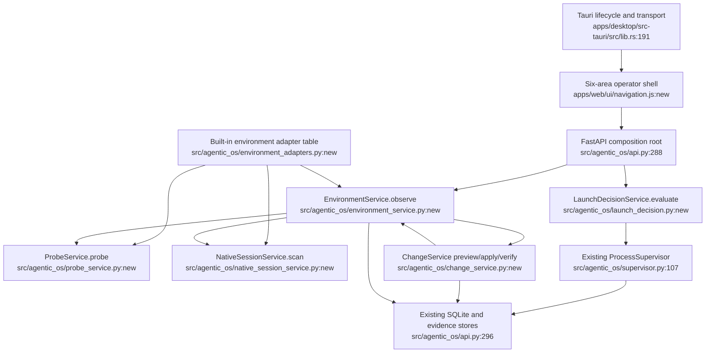

# Unified Architecture Proposal

Date: 2026-07-17

## Decision

Evolve `agentic-os` into a **Local Agent Environment Manager**. Preserve the
daemon, persistence, process supervisor, safe-edit engine, remote security
boundary, and Tauri lifecycle. Do not fork another Agent OS and do not add an
agent runtime.

The unification is deliberately static and local:

- one built-in adapter table, not a dynamic plugin loader;
- one normalized environment read model;
- one change-plan lifecycle over existing mutation primitives;
- one native-session scanner service;
- one health probe executor;
- one Desktop transport contract;
- six operator areas instead of fifteen top-level tabs.

## Unified system 1: Environment service

Single entry point:

```python
EnvironmentService.observe(environment_id: str | None = None) -> list[Environment]
```

Target files:

- `src/agentic_os/environment_models.py:new`
- `src/agentic_os/environment_adapters.py:new`
- `src/agentic_os/environment_service.py:new`
- `src/agentic_os/api.py:425`

`EnvironmentAdapter` is a frozen built-in definition containing identity,
supported surfaces, probe functions, config/capability readers, native-session
parser, and declared actions. It references existing specialized readers rather
than replacing their parsing code.

Old call sites become projections over the same service:

- `/tools/discovery` projects CLI surfaces;
- `/tools/inventory` projects config summaries;
- `/tools/capabilities` projects capability observations;
- `/agentic/inventory` projects runtime surfaces;
- `/harness-contracts` projects declared actions;
- new `/environments` and `/environments/{id}` return the complete read model.

Capability loss: none. Old endpoints remain compatible until their consumers
move to `/environments`.

## Unified system 2: Probe and native-session services

Single health entry point:

```python
ProbeService.probe(agent: AgentDefinition) -> ProbeResult
```

Single native-session entry point:

```python
NativeSessionService.scan(
    environment_id: str | None,
    workspace: str | None,
    within_hours: int,
    limit: int,
) -> NativeSessionScan
```

Target files:

- `src/agentic_os/probe_service.py:new`
- `src/agentic_os/native_session_service.py:new`
- `src/agentic_os/api.py:645`
- `src/agentic_os/health_prober.py:20`
- `src/agentic_os/live_sessions.py:314`
- `src/agentic_os/attach.py:146`

Tool-specific metadata parsers remain specialized. Traversal bounds, freshness,
identity normalization, error isolation, and result models become shared.

Old call sites become:

- per-harness health calls `ProbeService.probe()` and returns detailed fields;
- fleet probe calls the same service concurrently and persists the result;
- live radar, transcript lookup, workspace discovery, and bind consume one
  normalized native-session record;
- attach execution remains separate because it has a different process
  ownership model.

Capability loss: none. Attach still supports only declared upstream commands.

## Unified system 3: Change plan lifecycle

Single entry point:

```python
ChangeService.preview(request: ChangeRequest) -> ChangePlan
ChangeService.apply(plan_id: str) -> ChangePlan
ChangeService.rollback(plan_id: str) -> ChangePlan
```

Target files:

- `src/agentic_os/change_models.py:new`
- `src/agentic_os/change_store.py:new`
- `src/agentic_os/change_service.py:new`
- `src/agentic_os/safe_edit.py:54`
- `src/agentic_os/api.py:534`
- `src/agentic_os/api.py:2326`
- `src/agentic_os/api.py:2545`
- `src/agentic_os/api.py:2656`

There is no generic mutation DSL. `ChangeRequest` is a discriminated union of
the supported operations already present in the product:

- MCP copy/remove;
- workflow-surface patch;
- agentic-os config patch;
- harness-native config patch;
- profile/registry file patch.

Each operation delegates planning and applying to existing builders and
`SafeEditEngine`. The service adds a durable envelope:

```text
Observe -> Preview -> Approved -> Apply -> Re-observe -> Verified/Partial/Failed
```

Every plan stores redacted target surfaces, diff, base version, restart/reload
requirements, backup reference, apply result, verification evidence, and
rollback status. Apply refuses stale plans. Rollback re-observes the target and
records whether restoration was verified.

SQLite skill/MCP/policy catalog mutations keep their existing relational
history in this scope. They are surfaced in the Changes timeline but are not
forced through file-oriented `SafeEditEngine`.

Capability loss: generic catalog writes become preview-first. Existing direct
apply endpoints remain as compatibility wrappers that internally preview and
apply in one request only when explicitly requested.

## Unified system 4: Launch decision service

Single entry point:

```python
LaunchDecisionService.evaluate(context: LaunchContext) -> LaunchDecision
```

Target files:

- `src/agentic_os/launch_decision.py:new`
- `src/agentic_os/api.py:989`
- `src/agentic_os/api.py:1423`
- `src/agentic_os/api.py:1601`
- `src/agentic_os/api.py:2069`

The service owns capacity, policy evaluation, missing-policy semantics, approval
requirements, and audit evidence. Routes continue to own request parsing and
source-specific session construction.

Locked semantic decision: a missing policy remains open-by-default for launch
compatibility, but the decision is explicit, warning-bearing, and audited.
Explicit `/policy/evaluate` returns the same decision rather than a conflicting
deny.

Capability loss: none.

## Unified system 5: Desktop transport and operator shell

Transport entry point:

```rust
connection::api_request(method, path, body)
```

Operator shell entry point:

```javascript
AgenticOs.Navigation.show(area, view)
```

Target files:

- `apps/desktop/src-tauri/src/connection.rs:44`
- `apps/desktop/src-tauri/src/remote.rs:171`
- `apps/web/api.js:150`
- `apps/web/ui/navigation.js:new`
- `apps/web/ui/environment-manager.js:new`
- `apps/web/ui/change-center.js:new`
- `apps/web/index.html:52`
- `apps/web/app.js:26`

The Rust transport supports GET, POST, PUT, PATCH, and DELETE with one response
and error contract. Remote event consumption uses an authenticated polling
endpoint through the Rust bridge; the Keychain token never enters JavaScript.
The existing SSE endpoint remains compatible for native remote clients.

The sidebar has six areas:

1. Home
2. Environments
3. Sessions
4. Capabilities
5. Changes
6. Settings

Existing panels and modules remain as subviews during migration. The old
fifteen-tab implementation is not kept as a second navigation mode.

Capability loss: none. Chat remains a Sessions subview, not a top-level product
identity.

## Combined target flow



## Anti-pattern guards

- No dynamic adapter loading, marketplace, or third-party code execution.
- No second daemon or agent loop.
- No feature flag preserving both old and new navigation.
- No generic workflow/mutation language.
- No frontend framework migration.
- No mandatory Docker or Kubernetes.
- No claim that CLI evidence proves Desktop, IDE, runtime, auth, or config
  adoption.

